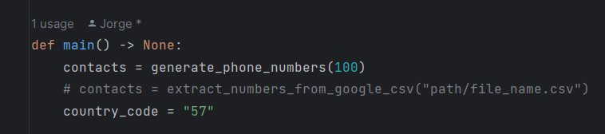
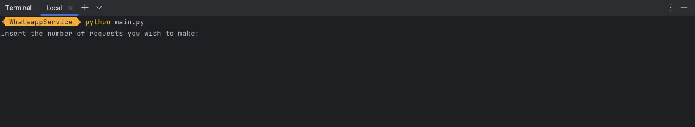

# Tiempo de Respuesta y la Alta Disponibilidad en un Sistema de Emergencia

La integración de un API de WhatsApp para enviar mensajes instantáneos
y directos durante situaciones de emergencia puede ser una herramienta muy
útil para mejorar el tiempo de respuesta y la eficiencia de las operaciones de
respuesta. Al utilizar WhatsApp, se puede aprovechar la amplia disponibilidad
y familiaridad de esta plataforma de mensajería instantánea, lo que facilita la
comunicación con los equipos de respuesta y las personas afectadas.
Al enviar mensajes de alerta a través de WhatsApp, se puede proporcionar
información crítica de manera rápida y directa. Esto incluye detalles sobre la
situación de emergencia, instrucciones de seguridad, recomendaciones específicas
y cualquier otra información relevante. Los mensajes pueden ser enviados a
grupos de respuesta, lo que permite una distribución eficiente de la información
entre los miembros del equipo y una mejor coordinación de las acciones.
Además, la comunicación instantánea proporcionada por WhatsApp permite
a los equipos de respuesta y las personas afectadas intercambiar información en
tiempo real. Esto puede facilitar la toma de decisiones informadas y permitir
ajustes rápidos en función de la evolución de la situación. También se pueden
establecer canales de comunicación bidireccional, lo que permite a las personas
afectadas informar sobre su estado, solicitar asistencia o hacer preguntas,

---
### Prerrequisitos
Para elaborar este proyecto requerimos de las siguientes tecnologías:

 -[***Python3***](https://www.python.org/about/): Python es un lenguaje de propósito general, lo que significa que se puede utilizar para crear una variedad de programas diferentes y no está especializado en ningún problema específico.

Además de hacer uso de un [***proyecto***](https://github.com/leifermendez/api-whatsapp-ts) que permite el uso del servicio api para conectarse a whatsapp web y mandar mensajes.

---
### Instalación
Primero clonamos el repositorio

     git https://github.com/jorge-stack/Tiempo_de_respuesta_y_la_alta_disponibilidad_en_un_sistema_de_emergencia.git
    
Se accede al repositorio que acabamos de clonar

	 cd Tiempo_de_respuesta_y_la_alta_disponibilidad_en_un_sistema_de_emergencia
---
### Corriendo
Primero debemos decidir si usar el servicio de generar números telefonicos o extraerlos desde un .csv exportado de la lista de contactos de google. para esto deberemos descomentar la linea con el generador de la lista de contactos que deseamos

En caso de usar `generate_phone_numbers` lo unico que debe pasarle por parametro es la cantidad de numeros telefonicos que desea generar. En caso contrario de desear usar el `extract_numbers_from_google_csv` el parametro que le pasa es la ruta y el nombre del archivo con la extension `.csv`.

### Run
Para correr el programa que hemos utilizado, primero deberemos haber levantado el servicio de node con:

    npm install
    
    npm run build
    
    npm run dev

Como se muestra en el repositorio original del proyecto de node, ahora escaneamos con la aplicación de whatsapp en nuestros telefonos el codigo qr que se genera en la carpeta de `tmp`. Una vez la consola de nuestro proyecto corriendo con npm nos muestre que se inicio sesion exitosamente podremos arrancar nuestro programa en python con:

    python main.py

En este momento en la consola nos aparecera la oportunidad de introducir el número de solicitudes que se generaran

El codigo tomara de manera aleatoria numeros de el arreglo de contactos que generamos o extraimos, y de esa manera ira enviando los mensajes, como se muestra en el video de ejemplo.
	
---
## Construido con

* [***Python3***](https://www.python.org/about/): Python es un lenguaje de propósito general, lo que significa que se puede utilizar para crear una variedad de programas diferentes y no está especializado en ningún problema específico.
* [***Git***](https://rometools.github.io/rome/):  Es un sistema de control de versiones distribuido (VCS).
* [***PyCharm***](https://www.jetbrains.com/pycharm/): Es un entorno de desarrollo integrado (IDE) utilizado en programación informática, concretamente para el lenguaje de programación Python.

## Autor
* **[Jorge David Saenz Diaz](https://co.linkedin.com/in/jorgedsaenzd/en)**  - [Jorge-Stack](https://github.com/jorge-stack?tab=repositories)
* **[Juan Camilo Molina Leon](https://co.linkedin.com/in/jorgedsaenzd/en)**  - [liontama2121](https://github.com/liontama2121)
* **[David Alejandro Leon Moreno](https://co.linkedin.com/in/jorgedsaenzd/en)**  - [davidleon03](https://github.com/davidleon03)

## Licencia
**©** Jorge David Saenz Diaz, Estudiante de Ingeniería de Sistemas de la Escuela Colombiana de Ingeniería Julio Garavito.
